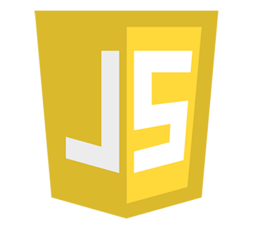

# Catchmoji - Emoji Day Hackathon

# Team: Smiley Squad

# Table of Contents

Table of Contents

* [Introduction](#introduction)
    * [Technologies Used](#technologies-used)
* [Features](#features)
    * [Exisiting Features](#existing-features)
    * [Future Features](#future-features)
* [Design](#design) 
    * [Wireframes](#wireframes)
    * [Typography](#typography)
    * [Images](#images)
    * [Colour Scheme](#colour-scheme)
* [Testing](#testing)
    * [Validator Testing](#validator-testing)
    * [Bugs](#bugs)
* [Deployment](#deployment)  
* [Credits](#credits)  

## Introduction
Welcome to the README for Catchmoji! Catchmoji is a website created for the July Hackathon with the Code Institute. It was build, designed and deployed by Team Smiley Squad. Smiley Squad consists of Eric Gaona, Vanessa Anna-Maria Andersson, Keith Millar, Oluwaseyi Badero, Nico Brown, Grace McKenna and Rebecca Marriott. 
### Technologies Used
  
  
 
 
 

## Features
### Existing Features
### Future Features

## Design
### Wireframes
### Typography
### Images
### Colour Scheme

## Testing
### Validator Testing
### Bugs

## Deployment

## Credits