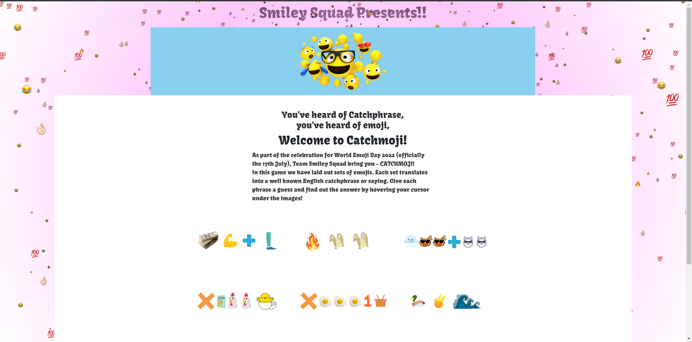

# Catchmoji - Emoji Day Hackathon

# Team: Smiley Squad

# Table of Contents

Table of Contents

* [Introduction](#introduction)
* [Technologies Used](#technologies-used)
* [Features](#features)
    * [Exisiting Features](#existing-features)
    * [Future Features](#future-features)
* [Design](#design) 
    * [User Stories](#user-stories)
    * [Wireframe](#wireframe)
    * [Typography](#typography)
    * [Images](#images)
    * [Colour Scheme](#colour-scheme)
* [Testing](#testing)
    * [Validator Testing](#validator-testing)
    * [Bugs](#bugs)  
* [Credits](#credits)  

[View the live project here.]()
## Introduction
Welcome to the README for Catchmoji! Catchmoji is a website created for the July Hackathon with the Code Institute. It was built, designed and deployed by Team Smiley Squad. Smiley Squad consists of Eric Gaona, Vanessa Anna-Maria Andersson, Keith Millar, Oluwaseyi Badero, Nico Brown, Grace McKenna and Rebecca Marriott. 

## Technologies Used
  
 The HyperText Markup Language or HTML is the standard markup language for documents designed to be displayed in a web browser. HTML was used to construct the base of our website and structure.
  
  
 Cascading Style Sheets is a style sheet language used for describing the presentation of a document written in a markup language such as HTML. CSS was used to style our website and make it responsive.
  
 
 Bootstrap is a free, open-source CSS framework directed at responsive, mobile-first, front-end web development. It contains HTML, CSS and JavaScript-based design templates for typography, forms, buttons, navigation, and other interface components.
We used Bootstrap for our project to create the index.html file and create a great user experience.
 
 
 Google Fonts is a computer font and web font service owned by Google. We used it to import some fonts that we wanted to use on our website to make it look more visually appealing.
  
 
 Balsamiq is a wireframes tool used to construct basic mock ups. We used this to help form our ideas for the design of the site and as a reference.
 

## Features
When planning our project, there were a number of features we wanted to implement. Due to time constraints we could not achieve them all. Below we have laid out what we have and haven't achieved.
* ### Existing Features
    - #### Catchmoji Game
    The Catchmoji game is a simple guessing game. Each set of emojis represent a catch phrase or well known saying. For each set of emojis, the answer is hidden below and can be viewed by hovering over the space.
    - #### Footer 
    The footer includes copyright text and links to the team's github profiles. 

* ### Future Features
    - #### Drag and Drop
    Initially we wanted to use a drag and drop feature in the Catchmoji game, however since it would take a longer time we decided to go with the simplier method of multiple choice. Drag and drop is something that could be implemented later on.
    - #### JavaScript Game
    We also originally intended on making the game with Javascript, however we encountered a bug which is detailed in <a href="#bugs">bugs</a>. Due to this issue we were set back time and once it was resolved, we ran out of time to finish the coding. As a back up, we had a basic HTML page built in case an issue like this arose. 
     

## Design
For this project, design began once we had a rough idea of what kind of game we wanted to create. Once we decided how we were going to implement it, we then designed the site around the game. 

- ### User Stories 
    - As a user I can play the game as soon as I enter the home page so that I get to celebrate National Emoji Day in a fun way.
    
- ### Wireframe

This was the basic structure and layout of our website when we were first designing it. This does not represent the final product as things changed during development, however it has been updated as we planned. This wireframe is what we intended the site to look like if it had been built with javascript.
 

This is the wireframe we did for the back-up site without javascript. Like our other wireframe, design changed as we developed the site.
 

- ### Typography
We used a Google Font for this project and the one we chose was Kavoon, with an alternative of serif. We chose this font because we felt it went well with the cartoony style of the emojis.
- ### Images
We felt that using a responsive background that included emojis and a bright constrasting colour to the text and text background would help gain a user's attention. The background is using Three.js to generate some emoji particles and move the scene following the mouse movements. 
We also used an image with emojis on it as a banner, giving the user a clear idea what our webpage is about.
- ### Colour Scheme

## Testing
### Validator Testing
W3C Validator for HTML: Passed
 
W3C Validator for CSS: Passed

### Bugs
- When we were attempting to build the quiz with javascript, we encountered a bug where the submit button didn't seem to work. Due to team member availability, this bug wasn't resolved until the next day. The problem ended up being a canvas tag which covered the button, without having the correct CSS it blocked us from clicking the button. 
 
Due to the time constraints and loss of time to work, we were unable to complete the javascript programming. This is when we used our back-up plan of a more basic HTML site. 

- When index.html was put through the validator, some duplicate uses of certain IDs were highlighted and a few unclosed tags. This was fixed before being run through the validator again. 

## Credits

- sebastianwachter for his [EmojiDomain project](https://github.com/sebastianwachter/emoji-domain)